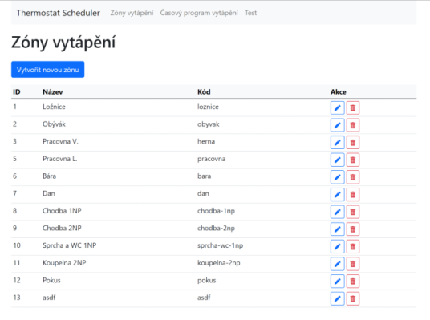
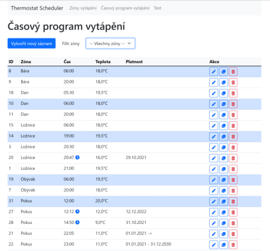
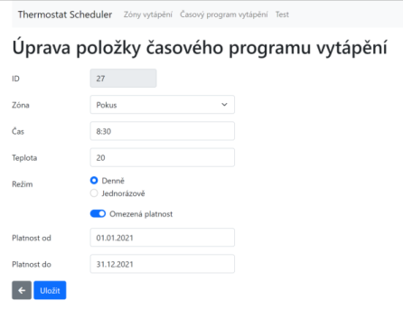

# Thermostat Scheduler

Simple web application for personal use that allows to schedule temperature for individual zones. When scheduled event occurs message with temperature and zone is published into MQTT topic. In my configuration message is processed in Home Assistant and Node-RED.

Application is published as Docker image `hladik/thermostat-scheduler`.

## Screenshosts

## Frameworks and libraries used

- .NET 5.0
- DotVVM - open source MVVM web framework (https://www.dotvvm.com/, https://github.com/riganti/dotvvm)
- NewtonsoftJ JSON (https://www.newtonsoft.com/json)
- JSON Flat File Data Store - to store configuration data into JSON file (https://github.com/ttu/json-flatfile-datastore)
- MQTTnet - MQTT library, used MQTT client (https://github.com/chkr1011/MQTTnet)
- Quartz.NET - scheduling framework (https://www.quartz-scheduler.net/)
- Serilog - logging framework (https://github.com/serilog/serilog)
- Bootstrap - https://getbootstrap.com/
- Font Awesome - https://fontawesome.com

## License
[MIT License](LICENSE)
